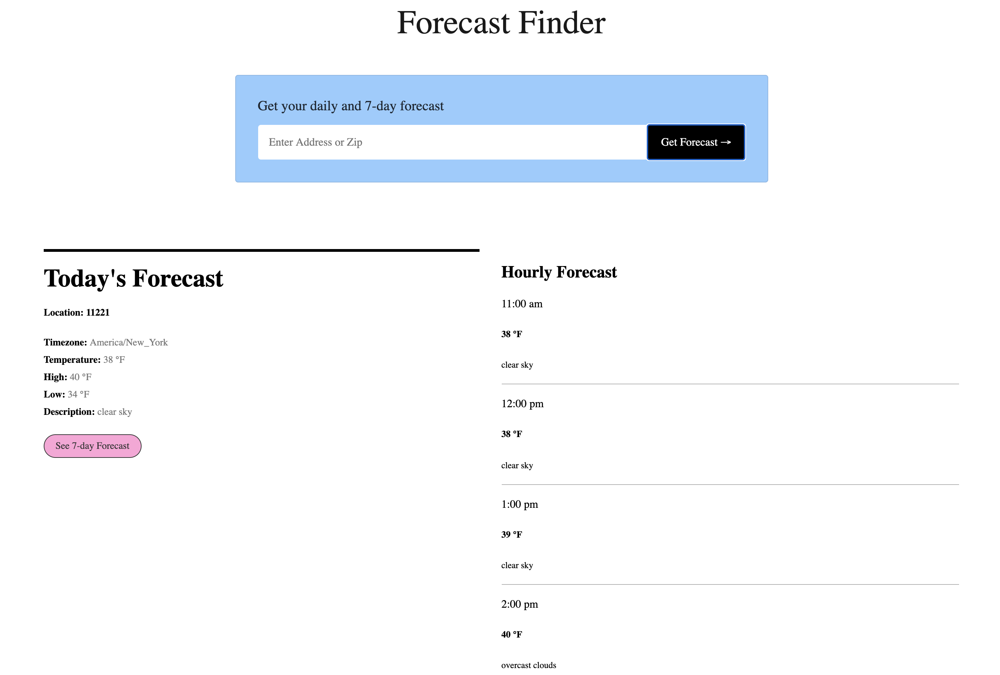

<h1 align='center'><b>
Forecast Finder</b>
</h1>

## **Preview**

## **Features**

Allows users to search for weather in locations of interest by zip code or address.  Provides current, hourly and 7-day forecasts.

## **Tech Stack**

This web app makes use of the following:

**APIs**

- [Open Weather](https://openweathermap.org/api) - Weather API
- [Google Maps Geocoding API](https://developers.google.com/maps/documentation/geocoding/overview) 

**Frontend**

- [React.js](https://reactjs.org/) - Javascript library
- [Tachyons ](https://tachyons.io/) - CSS Toolkit
- [react-geocode](https://www.npmjs.com/package/react-geocode) - NPM Module
- [moment.js](https://momentjs.com/) - Date And Time Parser

## **Prerequisites**

This project was created on MacOS. Before you begin, you will need API keys from Open Weather API and Google Maps Platform API. Also ensure you have installed the latest version of the following for the OS of your choice:

- [Node.js and npm](https://nodejs.org/en/)

## **Installation and Setup**

- Clone this repo to your local machine `git clone git <this-repo-url>`
- `cd` to forecast-finder directory
- Create a .env file in the root of the directory with API KEYS as follows:
  - REACT_APP_WEATHER_API_KEY=your_openweather_api_key and REACT_APP_GOOGLE_API_KEY=your_google_maps_platform_api_key
- run `npm install` to install all dependencies
- run `npm start` to install all dependencies and launch react app
- Ensure server is up and running at `http://localhost:3000/`

## **Future Work**
- Allow users to favorite locations and display those locations in a list.
- Allow users to click on a location from that list to load it's forecast.
- Include iconography for improved styling.
- Add search form validation and error notification for user.

